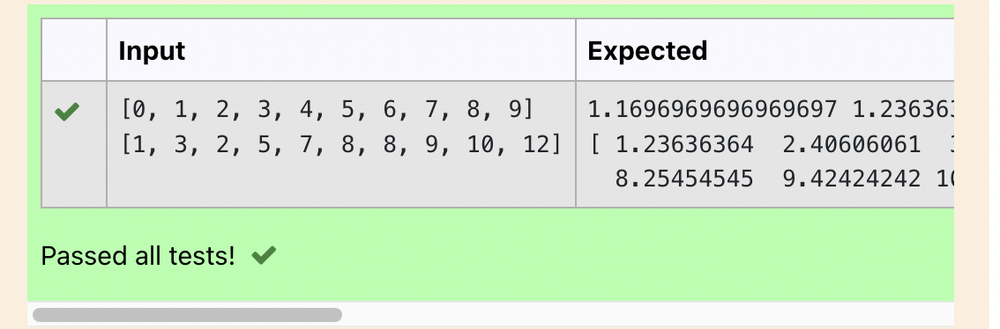

# Implementation of K-Means Clustering Algorithm
## Aim
To write a python program to implement K-Means Clustering Algorithm.
## Equipment’s required:
1.	Hardware – PCs
2.	Anaconda – Python 3.7 Installation

## Algorithm:

### step 1:
Get the independent variable X and dependent variable Y.

### step 2:
Calculate the mean of the X -values and the mean of the Y -values.

### step 3:
Find the slope m of the line of best fit using the formula. eqn1

### step 4:
Compute the y -intercept of the line by using the formula: eqn2

### step5:
Use the slope m and the y -intercept to form the equation of the line.

### step 6:
Obtain the straight line equation Y=mX+b and plot the scatterplot.

## Program:
~~~
import numpy as np
import matplotlib.pyplot as plt
x = np.array(eval(input()))
y = np.array(eval(input()))
x_mean=np.mean(x)
y_mean=np.mean(y)
num=0
deno=0
for i in range(len(x)):
num+=(x[i]-x_mean)*(y[i]-y_mean)
deno+=(x[i]-x_mean)**2
m=num/deno
b=y_mean-m*x_mean
print(m,b)
y=m*x+b
print(y)
plt.scatter(x,y)
plt.plot(x,y,color='purple')

~~~
## Output:

### Insert your output

 

## Result
Thus the K-means clustering algorithm is implemented and predicted the cluster class using python program.
